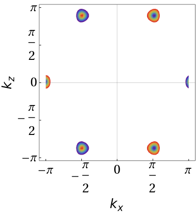

# Animation of Eigenvalues of Haldane Model

Python code based on KWANT to finde eigenvalues for Haldane Model. Returns animated gif.
Also calculates and plots berry phase along with andimated gif.

## Instructions
* running runGraphene.sh will call graphineHaldaneModel.py.

* Eigenvalues will be placed within datafolder and labeled accordingly

* data will be taken for a range of chemical potentials and saved as individual .txt files

* Running mathematica program createHaldaneAnimatedGif.m and createBerryPhaseGif.m will read all of the data and output an animated gifs which spans range of chemical potentials

## To Do
* label changing \mu value on plot
* add option to plot single plot rather than gif
* make mathmeatica code automatically read mu values from file names.
* try to add mathematica plots to the jobscript.

## Acknowledgments
* much of the code within the functions file originated from the open source KWANT project
  https://kwant-project.org/
  and the affiliated online course
  https://www.edx.org/course/topology-condensed-matter-tying-quantum-delftx-topocmx-0
